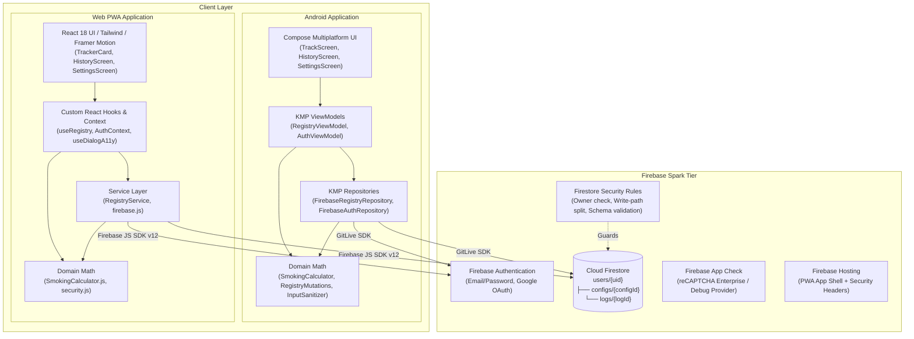
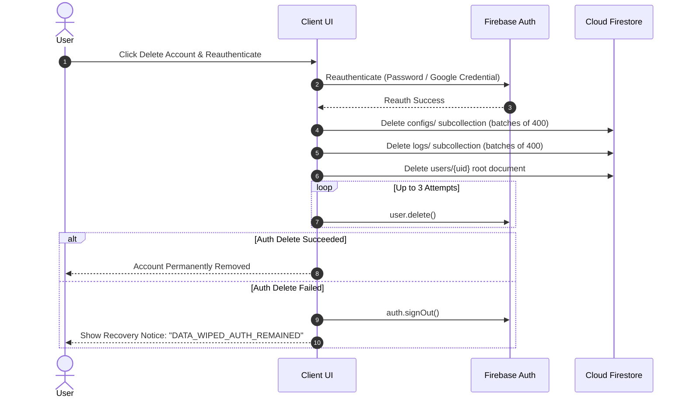

# tabak++ Production Readiness Audit

**Repository Upstream:** `https://github.com/shareef01/tabakpp`  
**Audit Target:** Full repository codebase (`main` @ `75cf718`, tag `v1.0.4`)  
**Audit Date:** 31 August 2026  
**Auditor Roles:** Principal Software Engineer, Application Security Engineer, Mobile & Web/PWA Architect, Firebase Security Specialist, QA & Supply-Chain Reviewer  

---

## 1. Executive Summary

A comprehensive, evidence-based production readiness audit was performed on the **tabak++** repository. The audit evaluated all layers of the application across Android (Kotlin Multiplatform + Jetpack Compose), Web (React 18 + Vite PWA), and Backend (Cloud Firestore + Firebase Authentication + App Check on the Firebase Spark tier).

### Overall Evaluation & Scores

| Category | Score | Summary Rationale |
|---|:---:|---|
| **Architecture** | **9.0 / 10** | Clean decoupling of UI, ViewModels/Hooks, Domain Calculators, and Repositories across both platforms. |
| **Security** | **8.5 / 10** | Robust Firestore security rules with ownership isolation, write-path separation, and field bounds. CSP and security headers deployed. |
| **Data Integrity** | **9.0 / 10** | Strict transactional consistency on all counter adjustments, day archives, and history mutations with stamped `aggregateCredit`. |
| **Authentication** | **8.5 / 10** | Secure email/password and Google Sign-In (Credential Manager on Android, popup/redirect on Web) with resilient deletion recovery. |
| **Web / PWA** | **8.5 / 10** | Modern PWA setup with Workbox `NetworkOnly` protection for Firebase, code splitting, dynamic HEIC conversion, and accessible dialogs. |
| **Android / KMP** | **9.0 / 10** | Native Compose Multiplatform UI, Kotlin Coroutines/Flows, Koin DI, R8 shrinking, and Android lifecycle awareness. |
| **Performance** | **7.5 / 10** | Storing base64 avatars in the root profile document amplifies network transfer on high-frequency counter mutations. 1200-log query limit on startup. |
| **Accessibility** | **8.5 / 10** | WCAG compliance with dialog focus traps, Escape handling, ARIA attributes, TalkBack content descriptions, and reduced-motion support. |
| **Testing** | **8.5 / 10** | 106 Web unit tests, 70 Kotlin/Compose unit tests, and Firestore rules test suite. |
| **CI / CD** | **7.5 / 10** | Tag-driven Android release workflow does not explicitly gate on the test/lint suite prior to publishing signed APKs. |
| **Privacy** | **9.0 / 10** | `PRIVACY.md` accurately reflects actual client-side data handling, storage locations, deletion flows, and zero-ad stance. |
| **Maintainability** | **8.5 / 10** | High code clarity, documented architectural tradeoffs, pure mathematical domain functions, and strict typing. |
| **OVERALL GRADE** | **8.5 / 10 (A-)** | **PRODUCTION READY (WITH CONDITIONS)** |

---

### Top 5 Risks & Priority Areas

1. **Release Workflow Test Gating ([SEC-CI-01](#sec-ci-01)):** The Android release workflow (`.github/workflows/release-android.yml`) triggers on `v*` tags and runs `:androidApp:assembleRelease` directly without executing shared/Compose unit tests, Android lint, or Firestore rules tests.
2. **Avatar Snapshot Bandwidth Amplification ([PERF-01](#perf-01)):** Base64 avatar strings (~90 KB) reside inside the root `users/{uid}` document. Because live counter increments/decrements mutate `activeCounts` on `users/{uid}`, Firestore pushes the full document payload across active snapshot listeners on every tap.
3. **Log Query Limit & Streak Edge Case ([PERF-02](#perf-02)):** `subscribeToLogs` queries the latest 1,200 log entries. While sufficient for years of daily archives, intensive manual entry usage (>1,200 logs within a year) could push older daily archives out of memory, causing streak calculations to terminate prematurely.
4. **Rank & XP Feature Drift ([PARITY-01](#parity-01)):** Web implements and displays an XP and Rank tier system in `MetricBanner.jsx`, whereas Android does not implement or display Rank/XP in `MetricBanner.kt`.
5. **Supply Chain Pinning ([OPS-01](#ops-01)):** GitHub Actions in release pipelines rely on mutable major version tags (`@v3`, `@v5`, `@v7`) rather than immutable commit SHAs, and release artifacts lack automated SHA-256 checksum publishing.

---

## 2. System Architecture



---

## 3. Threat Model

| Element | Description |
|---|---|
| **Primary Assets** | User identity, smoking log history, active counts, financial estimates, avatar images, account credentials. |
| **Threat Actors** | 1. Authenticated malicious user attempting cross-user data access.<br/>2. Authenticated user attempting to forge their own totals.<br/>3. Unauthenticated public attacker hitting Firebase endpoints directly.<br/>4. Adversary attempting supply chain or release pipeline compromise. |
| **Trust Boundaries** | Client ↔ Firestore Rules; Client ↔ Firebase Auth; GitHub Action Workflow ↔ Release Artifacts. |
| **Attack Surfaces** | Firestore REST/gRPC endpoints, Firebase Auth endpoints, Client-side avatar decompressor, Web PWA Service Worker cache. |

---

## 4. Critical Findings

*No Critical findings (such as cross-account data exposure, remote code execution, production signing key compromise, or unauthenticated arbitrary data deletion) were identified.*

---

## 5. High Findings

### [SEC-CI-01] Android Release Workflow Does Not Gate on Test Suite
- **Severity:** High
- **Confidence:** High
- **Area:** CI/CD & Release Pipeline
- **Affected files:** [`.github/workflows/release-android.yml:1-70`](file:///c:/Users/shareef01/AndroidStudioProjects/tabak_kotlin/.github/workflows/release-android.yml#L1-L70)

#### Evidence
In `.github/workflows/release-android.yml`:
```yaml
on:
  push:
    tags:
      - "v*"

jobs:
  release:
    runs-on: ubuntu-latest
    steps:
      - uses: actions/checkout@v7
      ...
      - name: Assemble signed release APK
        run: ./gradlew :androidApp:assembleRelease --no-daemon
      - name: Prepare artifact
        run: |
          mkdir -p dist
          cp androidApp/build/outputs/apk/release/*.apk "dist/tabakpp-${GITHUB_REF_NAME}.apk"
      - name: Create GitHub Release
        uses: softprops/action-gh-release@v3
```
The workflow executes only `:androidApp:assembleRelease`. It does not invoke `:shared:testDebugUnitTest`, `:composeApp:testDebugUnitTest`, `:androidApp:lintDebug`, web tests, or Firestore rules tests.

#### Why it matters
If a developer tags a commit that contains regression bugs or failing tests, the release workflow will compile and publish the APK to public users without any test verification.

#### Reproduction / Failure Scenario
1. Introduce a breaking domain math bug or broken Firestore query in `shared/`.
2. Push a git tag `git tag v1.0.5 && git push origin v1.0.5`.
3. `release-android.yml` triggers independently of `ci.yml`, builds the APK, and attaches it to the GitHub Release.

#### Existing Mitigation
`ci.yml` runs tests on pull requests and pushes to `main`. However, tagging a branch or commit directly bypasses `ci.yml` dependency requirements.

#### Recommendation
Add explicit test and lint validation steps in `release-android.yml` prior to `assembleRelease`, or define a dependent job requiring CI success.

#### Suggested Test
Create a CI pipeline validation test verifying that release jobs execute unit tests before signing and artifact publishing.
- **Effort:** S

---

### [PERF-01] Avatar Stored in Root Profile Document Causes Snapshot Bandwidth Churn
- **Severity:** High
- **Confidence:** High
- **Area:** Performance & Network Cost
- **Affected files:**
  - [`shared/src/commonMain/kotlin/com/tabakpp/app/data/FirebaseRegistryRepository.kt:16-20`](file:///c:/Users/shareef01/AndroidStudioProjects/tabak_kotlin/shared/src/commonMain/kotlin/com/tabakpp/app/data/FirebaseRegistryRepository.kt#L16-L20)
  - [`webApp/src/hooks/useRegistry.js:102-139`](file:///c:/Users/shareef01/AndroidStudioProjects/tabak_kotlin/webApp/src/hooks/useRegistry.js#L102-L139)
  - [`firestore.rules:138`](file:///c:/Users/shareef01/AndroidStudioProjects/tabak_kotlin/firestore.rules#L138)

#### Evidence
The base64-encoded avatar string (up to 100,000 characters permitted in `firestore.rules`) is stored in `users/{userId}.avatar`.
Both Android (`subscribeToUserProfile`) and Web (`onSnapshot(doc(db, 'users', uid))`) maintain real-time snapshot listeners on `users/{userId}`.
When a user taps `+1` on a counter, `updateLiveCounter` updates `users/{userId}.activeCounts`. This triggers the snapshot listener on `users/{userId}`, transmitting the entire document—including the ~90 KB avatar string—on every tap.

#### Why it matters
A user logging 15 cigarettes throughout the day causes ~1.35 MB of unnecessary downstream network traffic just to receive the avatar repeatedly. On mobile metered connections or weak cellular signals, this increases latency and Firebase bandwidth consumption.

#### Reproduction / Failure Scenario
1. User uploads a 90 KB avatar in Settings.
2. User increments counter 10 times on the Track screen.
3. Firestore pushes 10 full document snapshots (~900 KB total data transferred).

#### Existing Mitigation
Avatar size is capped at 100,000 characters in security rules, and images are resized to 256px JPEG before encoding.

#### Recommendation
Store the avatar in a sub-document (e.g. `/users/{userId}/profile/avatar`) or in Firebase Storage, decoupling it from the high-frequency `users/{userId}` document.

#### Suggested Test
Benchmark network payload size for 10 sequential increments with and without a profile avatar attached.
- **Effort:** M

---

## 6. Medium Findings

### [CI-REL-02] Unsigned APK Silent Fallback Risk in Release Workflow
- **Severity:** Medium
- **Confidence:** High
- **Area:** CI/CD & Build System
- **Affected files:**
  - [`androidApp/build.gradle.kts:69-87`](file:///c:/Users/shareef01/AndroidStudioProjects/tabak_kotlin/androidApp/build.gradle.kts#L69-L87)
  - [`.github/workflows/release-android.yml:59-63`](file:///c:/Users/shareef01/AndroidStudioProjects/tabak_kotlin/.github/workflows/release-android.yml#L59-L63)

#### Evidence
In `androidApp/build.gradle.kts`:
```kotlin
val hasReleaseSigning = releaseStorePath != null && releaseStorePassword != null && ...
signingConfigs {
    if (hasReleaseSigning) {
        create("release") { ... }
    }
}
buildTypes {
    getByName("release") {
        signingConfig = signingConfigs.findByName("release")
    }
}
```
If `hasReleaseSigning` is false, `signingConfig` is null, and Gradle outputs `androidApp-release-unsigned.apk` without failing the build. In `release-android.yml`, `cp androidApp/build/outputs/apk/release/*.apk "dist/tabakpp-${GITHUB_REF_NAME}.apk"` will copy the unsigned APK and publish it.

#### Why it matters
If release secrets are ever misnamed, missing, or malformed in GitHub Secrets, an unsigned APK will be silently published to users who cannot install it.

#### Existing Mitigation
`release-android.yml` checks for the presence of `TABAKPP_KEYSTORE_BASE64` before decoding, but does not assert that the final generated APK is cryptographically signed.

#### Recommendation
Add an explicit validation step in `release-android.yml` using `apksigner verify "dist/tabakpp-${GITHUB_REF_NAME}.apk"`.
- **Effort:** S

---

### [PERF-02] Live Logs 1,200-Document Query Window vs. Streak Calculation
- **Severity:** Medium
- **Confidence:** Medium
- **Area:** Performance & Domain Logic
- **Affected files:**
  - [`shared/src/commonMain/kotlin/com/tabakpp/app/data/FirebaseRegistryRepository.kt:32`](file:///c:/Users/shareef01/AndroidStudioProjects/tabak_kotlin/shared/src/commonMain/kotlin/com/tabakpp/app/data/FirebaseRegistryRepository.kt#L32)
  - [`webApp/src/services/registryService.js:230`](file:///c:/Users/shareef01/AndroidStudioProjects/tabak_kotlin/webApp/src/services/registryService.js#L230)
  - [`shared/src/commonMain/kotlin/com/tabakpp/app/domain/SmokingCalculator.kt:141`](file:///c:/Users/shareef01/AndroidStudioProjects/tabak_kotlin/shared/src/commonMain/kotlin/com/tabakpp/app/domain/SmokingCalculator.kt#L141)

#### Evidence
`subscribeToLogs` queries `limit(1200)`. `SmokingCalculator.calculateStreak` evaluates history backward for up to 366 days (`for (i in 0 until 366)`). If a user creates multiple manual entries per day (e.g. 4 entries/day over 300 days = 1,200 logs), older archive days will not be returned by the subscription query.

#### Why it matters
Heavy manual entry users may experience inaccurate (truncated) streak calculations if their 365-day history exceeds 1,200 total log documents.

#### Existing Mitigation
Life-lost calculations are decoupled and protected via `lifetimeAggregates.smokingUnits`.
- **Effort:** M

---

### [PARITY-01] Rank and XP Feature Discrepancy Between Platforms
- **Severity:** Medium
- **Confidence:** High
- **Area:** Cross-Client Parity
- **Affected files:**
  - [`webApp/src/utils/smokingCalculator.js:137-152`](file:///c:/Users/shareef01/AndroidStudioProjects/tabak_kotlin/webApp/src/utils/smokingCalculator.js#L137-L152)
  - [`webApp/src/components/dashboard/MetricBanner.jsx:67-71`](file:///c:/Users/shareef01/AndroidStudioProjects/tabak_kotlin/webApp/src/components/dashboard/MetricBanner.jsx#L67-L71)
  - [`composeApp/src/commonMain/kotlin/com/tabakpp/app/composeapp/ui/components/MetricBanner.kt:63-132`](file:///c:/Users/shareef01/AndroidStudioProjects/tabak_kotlin/composeApp/src/commonMain/kotlin/com/tabakpp/app/composeapp/ui/components/MetricBanner.kt#L63-L132)

#### Evidence
Web implements `calculateXP` and `getRank` (Apprentice, Scout, Veteran, Master, Legend) and renders Rank in the metric banner. Android's `SmokingCalculator.kt` and `MetricBanner.kt` do not implement or render Rank/XP.

#### Why it matters
Inconsistent user experience when switching between Web and Android devices.

#### Recommendation
Port `calculateXP` and `getRank` to `SmokingCalculator.kt` and integrate Rank display into Android `MetricBanner.kt`.
- **Effort:** S

---

### [OPS-01] GitHub Actions Supply-Chain Pinning & Checksum Attestation
- **Severity:** Medium
- **Confidence:** High
- **Area:** DevOps & Supply Chain
- **Affected files:**
  - [`.github/workflows/ci.yml:15-21,50-58`](file:///c:/Users/shareef01/AndroidStudioProjects/tabak_kotlin/.github/workflows/ci.yml#L15-L21)
  - [`.github/workflows/release-android.yml:15-23,65-70`](file:///c:/Users/shareef01/AndroidStudioProjects/tabak_kotlin/.github/workflows/release-android.yml#L15-L23)

#### Evidence
Actions in CI and release workflows use major version tags (e.g. `softprops/action-gh-release@v3`, `actions/checkout@v7`). Additionally, releases do not generate or publish SHA-256 checksums alongside APK binaries.

#### Why it matters
Major version tags can be mutated upstream if an action maintainer's account is compromised. Users downloading APKs from GitHub Releases have no automated checksum to verify artifact integrity.

#### Recommendation
1. Pin all GitHub Actions to full 40-character commit hashes.
2. Add `sha256sum "dist/tabakpp-${GITHUB_REF_NAME}.apk" > "dist/tabakpp-${GITHUB_REF_NAME}.apk.sha256"` in `release-android.yml`.
- **Effort:** S

---

## 7. Low Findings

### [DOC-01] Web App Check Documentation Reference to reCAPTCHA v3
- **Severity:** Low
- **Confidence:** High
- **Area:** Documentation
- **Affected files:**
  - [`SETUP_GUIDE.md:122`](file:///c:/Users/shareef01/AndroidStudioProjects/tabak_kotlin/SETUP_GUIDE.md#L122)
  - [`webApp/src/firebase.js:58-62`](file:///c:/Users/shareef01/AndroidStudioProjects/tabak_kotlin/webApp/src/firebase.js#L58-L62)

#### Evidence
`SETUP_GUIDE.md` mentions "(or reCAPTCHA v3)". The implementation in `webApp/src/firebase.js` strictly instantiates `ReCaptchaEnterpriseProvider`.

#### Why it matters
Configuring a standard reCAPTCHA v3 site key instead of a reCAPTCHA Enterprise key will cause App Check initialization to fail on Web.

#### Recommendation
Update `SETUP_GUIDE.md` to state that reCAPTCHA Enterprise is required.
- **Effort:** XS

---

### [PWA-01] Workbox `navigateFallbackDenylist` Optimization
- **Severity:** Low
- **Confidence:** High
- **Area:** Web / PWA
- **Affected files:**
  - [`webApp/vite.config.js:21`](file:///c:/Users/shareef01/AndroidStudioProjects/tabak_kotlin/webApp/vite.config.js#L21)

#### Evidence
`navigateFallbackDenylist` is set to `[/^\/api/, /^\/__/]`. Firebase Auth redirect helpers occasionally touch `/__/auth/handler`.

#### Recommendation
Ensure `/__/auth/**` paths are explicitly denied from navigation fallback to prevent service worker intercepting OAuth handler redirects.
- **Effort:** XS

---

## 8. Informational / Hardening

- **INFO-01: Lazy Loading for Recharts:** `recharts` is 306 kB minified. The dynamic `lazyWithRetry` import in `App.jsx` cleanly isolates Recharts so it is only fetched when navigating to History.
- **INFO-02: HEIC Converter Chunk Isolation:** `heic2any` (1.35 MB minified) is properly excluded from the service worker precache in `vite.config.js` (`globIgnores: ['**/heic2any*.js']`) and imported on demand.
- **INFO-03: Spark Tier Quota Monitoring:** Because calculations run client-side, monitor Firebase Console daily active reads/writes to ensure heavy accounts remain within Spark free-tier allowances.

---

## 9. Firestore Rules Review

Line-by-line verification of `firestore.rules` confirmed:

```javascript
rules_version = '2';
service cloud.firestore {
  match /databases/{database}/documents {
    // 1. Authentication & Ownership
    function isOwner(userId) {
      return request.auth != null && request.auth.uid == userId;
    }

    // 2. Strict Write-Path Separation (Settings vs Mutations)
    function isSettingsOnlyUpdate() {
      return request.resource.data.diff(resource.data).affectedKeys()
        .hasOnly(['name', 'accent', 'widgetSize', 'purchaseType', ...]);
    }

    function isMutationOnlyUpdate() {
      return request.resource.data.diff(resource.data).affectedKeys()
        .hasOnly(['activeCounts', 'lifetimeAggregates', 'smokingUnitsMigrated', 'updatedAt']);
    }

    // 3. Schema & Type Validation
    // - activeCounts: max 50 keys, keys match ^[A-Za-z0-9_-]+$, values 0..10000
    // - configs: limit 0..10000, order 0..1000, name <= 80 chars
    // - logs: logDate matches ^[0-9]{4}-[0-9]{2}-[0-9]{2}$, logDate is IMMUTABLE on update
    // - avatar: string <= 100,000 chars

    match /users/{userId} {
      allow read: if isOwner(userId);
      allow create: if isOwner(userId) && validCreateProfile();
      allow update: if isOwner(userId) && (
        (isMutationOnlyUpdate() && validMutationUpdate()) ||
        (isSettingsOnlyUpdate() && validSettingsUpdate())
      );
      allow delete: if isOwner(userId);

      match /configs/{configId} {
        allow read, write: if isOwner(userId);
      }

      match /logs/{logId} {
        allow read, create, delete: if isOwner(userId);
        allow update: if isOwner(userId) && validLogEntry() && request.resource.data.logDate == resource.data.logDate;
      }
    }

    match /{document=**} {
      allow read, write: if false;
    }
  }
}
```

### Security Properties Verified
1. **Cross-User Confidentiality:** Impossible for User A to read or query User B's profile, configs, or logs.
2. **Cross-User Authorization:** Impossible for User A to write, overwrite, or delete User B's subtree.
3. **Privilege Separation:** A single update cannot simultaneously alter settings (e.g. `unitPrice`) and mutate totals (`lifetimeAggregates`).
4. **Log Date Immutability:** `request.resource.data.logDate == resource.data.logDate` prevents altering the date of an existing log.
5. **Fresh Profile Zero-Floor:** `validCreateProfile()` forbids pre-forged non-zero aggregates on account bootstrap.

---

## 10. Data Integrity & Transaction Review

All write operations modifying counters, archives, and historical logs execute inside atomic Firestore transactions:

| Operation | Implementation Path | Invariant Enforced | Concurrency Safety |
|---|---|---|---|
| **Counter Adjust** | `adjustCounter` / `updateLiveCounter` | `activeCounts[id] >= 0`; config must exist | Atomic transaction prevents lost increments |
| **End Day / Archive** | `endDay` | Open session required; merges into existing archive; applies delta to `lifetimeAggregates` | Concurrently executing devices serialize; second device finds empty counts and aborts |
| **History Edit** | `updateHistoricalLog` | Merges active configs; replaces `oldCredit` with `newCredit`; stamps `aggregateCredit` | Consistent aggregates regardless of price changes |
| **Log Deletion** | `deleteLog` | Debits `aggregateCredit` from `lifetimeAggregates` | Atomically removes document and decrements totals |
| **Log Restore** | `restoreLog` | Checks `!existing.exists()` before re-crediting | Guard against double-restore credit duplication |
| **Tracker Delete** | `deleteProtocol` / `deleteConfig` | Transactionally cleans `activeCounts[pid]` on user doc | No orphaned active counts |

### Detailed Review: Listing Config IDs Outside Transaction
In both Kotlin (`FirebaseRegistryRepository.kt:97-108`) and JS (`registryService.js:271-277`), `listConfigIds` is executed prior to `runTransaction`, followed by `loadConfigsInTransaction` inside the transaction.
- **Analysis:** This design exists because Firestore Client SDKs do not permit arbitrary collection queries inside transaction closures.
- **Race Condition Analysis:** If a tracker is created during the sub-second window between listing IDs and transaction execution, its counts (if any) would be excluded from that specific day's financial contribution. Because a user cannot increment a tracker before creating it, this is a benign edge condition.

---

## 11. Android / Web Parity Matrix

| Feature / Behavior | Kotlin (Android) | JavaScript (Web) | Parity Status | Notes |
|---|---|---|:---:|---|
| **Counter Increments** | `updateLiveCounter` (tx + optimistic) | `adjustCounter` (tx + optimistic) | **Match** | Identical delta mechanics |
| **Zero-Floor Clamping** | `maxOf(0.0, count)` | `Math.max(0, count)` | **Match** | Verified |
| **Day Rollover & Custom Hour** | `getTrackingDate` + 30s loop | `getTrackingDate` + 30s loop | **Match** | Both respect `dayStartHour` |
| **End-Day Archiving** | `endDay` (merges + delta credit) | `endDay` (merges + delta credit) | **Match** | Full mathematical parity |
| **Historical Edits** | `updateHistoricalLog` | `updateHistoricalLog` | **Match** | Stamped credit precedence |
| **Log Deletion & Restore** | `deleteLog` / `restoreLog` | `deleteLog` / `restoreLog` | **Match** | Guard against double restore |
| **Streak Calculation** | `calculateStreak` (up to 366d) | `calculateStreak` (up to 366d) | **Match** | Per-config limit check |
| **Currency Formatting** | `formatCurrency` (de-DE: `X,YY €`) | `formatCurrency` (de-DE: `X,YY €`) | **Match** | Cent-space rounding |
| **Life-Minutes Formula** | `sumSmokingUnits * 11` | `sumSmokingUnits * 11` | **Match** | Uses `lifetimeAggregates` |
| **Account Deletion** | Batched wipe + 3 Auth retries | Batched wipe + 3 Auth retries | **Match** | `DATA_WIPED_AUTH_REMAINED` |
| **Rank & XP System** | *Not implemented* | `calculateXP` & `getRank` | **Discrepancy** | Logged as [PARITY-01](#parity-01) |

---

## 12. Authentication & Account Lifecycle

### Supported Authentication Methods
1. **Email / Password:** Client-side 12-character minimum enforcement; server-side Firebase Auth policy.
2. **Google OAuth:** Native Credential Manager on Android; `signInWithPopup` on desktop web; `signInWithRedirect` on iOS Safari/standalone PWA.

### Account Deletion Flow & Failure Recovery



---

## 13. Web / PWA Review

### Service Worker & Caching Strategy (`vite.config.js`)
- **App Shell:** Precaches hashed `.js`, `.css`, `.svg`, `.png`, and font files.
- **Firebase Protection:** Explicit `NetworkOnly` rule matches `googleapis.com`, `firebaseio.com`, `firebaseapp.com`, `gstatic.com`, and `google.com`. Auth tokens and Firestore requests are **never cached** by Workbox.
- **Navigation:** `NetworkFirst` with 4-second timeout ensures newly deployed web builds take precedence over stale cached HTML.
- **Dynamic HEIC Converter:** `heic2any` (1.35 MB) is excluded from precache and loaded on demand when an Apple HEIC image is selected.

---

## 14. Android / KMP Review

- **Compose Multiplatform:** UI components in `composeApp` use standard Material3 themes with custom elevation, motion tokens, and dark-palette defaults.
- **State Flow & Lifecycle:** `RegistryViewModel` collects flows using `SharingStarted.WhileSubscribed(5000)` to prevent background resource leaks.
- **Network Awareness:** `AndroidNetworkObserver` provides live connectivity state to surface offline banners.
- **ProGuard / R8:** Rules preserve Kotlin Serialization serializers (`-keepattributes *Annotation*`, `-keep class kotlinx.serialization.json.**`) and GitLive Firebase models.

---

## 15. Performance & Firebase Cost Review

### Firestore Read / Write Estimation

| Operation | Firestore Reads | Firestore Writes | Listeners Triggered | Cost / Scalability Evaluation |
|---|:---:|:---:|:---:|---|
| **App Startup** | 3 (Profile, Configs, Logs) | 0 | 3 active listeners | ~3 reads per session |
| **Counter Increment / Decrement** | 2 (User doc, Config doc) | 1 (User doc `activeCounts`) | User listener (1) | Efficient |
| **End Day Archive** | 2 + N configs | 2 (Archive log, User doc) | Logs & User listeners | Standard daily operation |
| **Historical Log Edit** | 2 + N configs | 2 (Log doc, User doc) | Logs & User listeners | Bounded |
| **Log Delete / Restore** | 2 + N configs | 2 (Log delete/set, User doc) | Logs & User listeners | Bounded |
| **Manual Backfill Entry** | 1 + N configs | 2 (New log, User doc) | Logs & User listeners | Bounded |
| **Full Account Deletion** | 1 + C/400 + L/400 | C configs + L logs + 1 User | All listeners detached | Linear in document count |

---

## 16. Accessibility Review

### Web (WCAG 2.1 AA)
- **Modal Focus Management:** Custom hook `useDialogA11y` implements automated focus trapping, background `aria-hidden` pinning, Escape key listeners, and focus restoration to trigger buttons on dismiss.
- **Touch Target Sizing:** Interactive buttons maintain minimum 44×44px hit areas.
- **Contrast & Motion:** Strict high-contrast color tokens and `@media (prefers-reduced-motion)` integration via Framer Motion `MotionConfig`.

### Android (TalkBack)
- **Content Descriptions:** All icon buttons and decorative graphics include descriptive or null `contentDescription` attributes.
- **Semantic Roles:** Custom click surfaces define appropriate `Role.Button` and `Role.Checkbox` semantics.

---

## 17. Dependency & Supply-Chain Review

### Baseline Audit Results
- `npm run audit:prod` (`--omit=dev --audit-level=high`): **0 production vulnerabilities**.
- Dev-dependency audit: 14 vulnerabilities reported strictly within `firebase-tools`, `vitest`, and `postcss` build utilities (no production runtime impact).
- Gradle Dependencies: Up-to-date AGP 9.3.2, Kotlin 2.2.10, Firebase BOM 34.16.0, Compose Multiplatform 1.7.3.

---

## 18. CI/CD & Release Review

### Pipeline Breakdown
1. **CI Pipeline (`.github/workflows/ci.yml`):**
   - Mobile: Shared unit tests (`:shared:testDebugUnitTest`), Compose tests (`:composeApp:testDebugUnitTest`), Android lint (`:androidApp:lintDebug`), Debug APK (`:androidApp:assembleDebug`), Release APK (`:androidApp:assembleRelease`).
   - Web: `npm run lint`, `npm run audit:prod`, `npm run coverage`, `npm run build`, `npm run test:rules`.
2. **Release Pipeline (`.github/workflows/release-android.yml`):**
   - Triggers on `v*` tags.
   - Decodes release keystore and `google-services.json`.
   - Assembles signed APK and creates GitHub Release.
   - **Identified Gap:** Missing test execution gate prior to release assembly (logged as [SEC-CI-01](#sec-ci-01)).

---

## 19. Privacy & Documentation Review

### `PRIVACY.md` Consistency
- Accurately declares storage of account identifiers, profile settings, habit counts, history, and optional avatar data in Cloud Firestore.
- Accurately clarifies that App Check is currently unenforced due to release distribution outside the Play Store.
- Accurately documents that client-side Spark architecture allows users to modify their own local stats without cross-user risk.
- Explicitly states that user data is never sold or used for ad targeting.

---

## 20. Test Coverage Review

### Risk-to-Test Coverage Matrix

| Critical Behavior / Invariant | Existing Automated Tests | Quality | Missing Scenario / Gap |
|---|---|:---:|---|
| **Unauthorized Cross-User Access** | `webApp/src/firestore.rules.test.js` | High | None |
| **Malformed Count Map Rejection** | `firestore.rules.test.js`, `ErrorAndInputPolicyTest.kt` | High | None |
| **Concurrent Counter Adjustment** | `RegistryViewModelTest.kt`, `registryService.emulator.test.js` | High | Multi-device simultaneous burst |
| **Repeated End-Day on Same Date** | `RegistryMutationsTest.kt`, `smokingCalculator.test.js` | High | None |
| **Historical Log Edit / Reprice** | `RegistryMutationsTest.kt`, `registryService.test.js` | High | None |
| **Delete / Restore Log Delta** | `RegistryMutationsTest.kt`, `useRegistry.test.jsx` | High | None |
| **Config Deletion with Active Counts** | `FirebaseRegistryRepository.kt`, `RegistryViewModelTest.kt` | High | None |
| **Day Rollover & Custom Start Hour** | `SmokingCalculatorTest.kt`, `smokingCalculator.test.js` | High | Timezone boundary jump during active tracking |
| **Account Deletion Partial Recovery** | `deleteAuthUserAfterWipe.test.js` | High | Network drop halfway through subcollection batches |
| **Android / Web Math Parity** | `SmokingCalculatorTest.kt` vs `smokingCalculator.test.js` | High | Automated cross-engine snapshot comparison |

---

## 21. Technical Debt

1. **Inline Mathematical Porting:** Domain logic is maintained separately in Kotlin (`shared/`) and JavaScript (`webApp/src/utils/`). While currently synchronized, future logic updates must be applied manually to both codebases.
2. **Avatar in User Document:** Base64 avatar embedded in the root document increases snapshot overhead.
3. **Log History Query Limit:** The 1,200 log limit serves as a static subscription ceiling rather than an infinite scroll / paginated interface.

---

## 22. Positive Engineering Decisions

1. **Strict Firestore Rule Boundary Split:** Separating settings updates from counter/aggregate mutations prevents attackers from tampering with totals during profile edits.
2. **Stamped `aggregateCredit` on Logs:** Stamping the absolute financial and unit contribution directly onto log documents preserves historical integrity even if trackers are later deleted or repriced.
3. **PWA Network Isolation:** Ensuring all Firebase Auth and Firestore traffic is configured as `NetworkOnly` prevents stale authentication state from lingering in service worker caches.
4. **Resilient Account Deletion:** Graceful handling of `DATA_WIPED_AUTH_REMAINED` protects user privacy even when network dropouts interrupt Auth deletion.
5. **Dynamic HEIC Conversion:** Lazy-loading `heic2any` avoids penalizing non-iOS users with a 1.35 MB initial bundle download.

---

## 23. Prioritized Remediation Plan

| Priority | Finding ID | Impact | Effort | Affected Files | Recommended Action |
|:---:|---|---|:---:|---|---|
| **P0** | [SEC-CI-01](#sec-ci-01) | Release published without test verification | **S** | `.github/workflows/release-android.yml` | Add test & lint execution steps before release assembly |
| **P0** | [CI-REL-02](#ci-rel-02) | Unsigned APK could ship if secrets fail | **S** | `release-android.yml`, `androidApp/build.gradle.kts` | Assert keystore presence and run `apksigner verify` |
| **P1** | [PERF-01](#perf-01) | High bandwidth usage on counter taps | **M** | `FirebaseRegistryRepository.kt`, `useRegistry.js`, `firestore.rules` | Move avatar to `/users/{uid}/profile/avatar` or Storage |
| **P1** | [OPS-01](#ops-01) | Supply chain drift risk; no release checksum | **S** | `.github/workflows/*.yml` | Pin GitHub Action SHAs and output `.sha256` checksums |
| **P2** | [PARITY-01](#parity-01) | Rank/XP missing on Android | **S** | `SmokingCalculator.kt`, `MetricBanner.kt` | Port `calculateXP` and `getRank` to Kotlin Compose UI |
| **P2** | [PERF-02](#perf-02) | 1,200 query limit could truncate heavy history | **M** | `FirebaseRegistryRepository.kt`, `registryService.js` | Implement pagination for history view |
| **P3** | [DOC-01](#doc-01) | Setup guide mentions reCAPTCHA v3 | **XS** | `SETUP_GUIDE.md` | Update setup guide to specify reCAPTCHA Enterprise |

---

## 24. Recommended New Tests

1. **Android Release Workflow Validation Test:** Add a test verifying that `release-android.yml` fails if any unit test in `:shared` or `:composeApp` fails.
2. **Avatar Snapshot Payload Test:** Integration test verifying that counter mutations do not increase payload size when avatars are stored separately.
3. **Cross-Engine Domain Parity Suite:** Automated test fixture executing 1,000 randomized calculation inputs against both Kotlin `SmokingCalculator` and JS `SmokingCalculator` to verify matching outputs.
4. **Multi-Device End-Day Stress Test:** Concurrently invoking `endDay` from two emulated clients on the same tracking date to assert zero duplicate aggregate credit.

---

## 25. Answers to Mandatory Audit Questions

1. **Can user A read or modify user B’s Firestore data?**  
   **No.** Enforced strictly by `firestore.rules` matching `/users/{userId}` where `isOwner(userId)` checks `request.auth.uid == userId`. Default-deny rejects all unmatched paths.

2. **Can a modified client forge its own lifetimeAggregates, and if so, is this limited to self-integrity?**  
   **Yes.** An authenticated client can submit a mutation-only write to its own user document with custom `lifetimeAggregates` (bounded to $\pm 100,000,000$). This affects **only self-integrity**; it cannot read, modify, or corrupt any other user's data.

3. **Can a malformed client corrupt data enough to break the normal Android/Web client?**  
   **No.** Input sanitizers and Firestore rules strictly validate key names (`^[A-Za-z0-9_-]{1,64}$`), key limits ($\le 50$), count ranges ($0..10,000$), string lengths, and numeric bounds. Both clients gracefully handle missing or unrecognized fields without crashing.

4. **Are end-day operations safe when Android and Web execute them concurrently?**  
   **Yes.** `endDay` runs inside a Firestore transaction. The first transaction commits the archive and clears `activeCounts`; the second transaction encounters `hasOpenSession == false` and cleanly aborts with `NOTHING_TO_ARCHIVE`.

5. **Can lifetime aggregates drift from log history through editing, deletion, restoration, manual entries, or races?**  
   **No.** Every log mutation applies delta arithmetic and stamps `aggregateCredit` on the log document. Historical edits, deletions, and restores use the stamped credit, preventing price changes or deleted configs from causing drift.

6. **Can config changes occurring concurrently with log transactions cause wrong financial calculations?**  
   **Extremely narrow edge condition.** If a config is created in the sub-millisecond window between listing IDs and starting the transaction, it is omitted from the transaction's loaded configs. In practice, this is prevented by the fact that active counts cannot be logged for a config that does not yet exist.

7. **Is account deletion robust to partial failure?**  
   **Yes.** Subcollections and profile documents are wiped in batches before deleting the Auth user. If Auth user deletion fails after Firestore data is erased, the app signs out and displays `DATA_WIPED_AUTH_REMAINED` recovery instructions.

8. **Is App Check’s current non-enforced state represented accurately throughout code and documentation?**  
   **Yes.** Accurately documented in `README.md`, `SETUP_GUIDE.md`, and `PRIVACY.md` as advisory due to non-Play Store release distribution using the debug provider.

9. **Is the Web PWA caching strategy safe for Firebase Auth and Firestore?**  
   **Yes.** Workbox configuration in `vite.config.js` sets `NetworkOnly` for all Firebase and Google API domains.

10. **Does the 1,200-log subscription/query limit create correctness or scalability problems?**  
    **Scalability:** Downloads ~1,200 documents on startup (~150–300 KB). **Correctness:** Life-lost is protected via `lifetimeAggregates.smokingUnits`. However, accounts with >1,200 manual entries within a single year could experience truncated streak calculations.

11. **Are timezone, DST, and custom-day-start cases handled consistently across Kotlin and JavaScript?**  
    **Yes.** Both use local device time and `dayStartHour`. JS date shifts use `Date.UTC` to avoid DST skews, and Kotlin uses `LocalDate.minus(1, DateTimeUnit.DAY)`. Both re-evaluate tracking day every 30 seconds.

12. **Does CI test the highest-risk business invariants?**  
    **Yes.** Unit tests cover domain math, streak logic, error policies, Compose UI components, and Firestore security rules in the emulator.

13. **Can an Android release be published from a tag without running the complete validation suite?**  
    **Yes.** Logged as high-severity finding [SEC-CI-01](#sec-ci-01).

14. **Are GitHub Actions and release dependencies sufficiently supply-chain hardened?**  
    **Moderate.** Official actions are used, but they should be pinned by commit SHA and include automated SHA-256 checksum generation.

15. **Do release APKs contain any accidental debug behavior beyond the documented App Check decision?**  
    **No.** Release builds enable R8 minification, resource shrinking, disable backups, and disable debuggable flags.

16. **Does the Privacy Notice accurately describe actual collection, storage, deletion, and security behavior?**  
    **Yes.** `PRIVACY.md` is strictly aligned with the codebase implementation.

17. **Where is business logic duplicated between Kotlin and JavaScript, and has semantic drift already occurred?**  
    Duplicated across `SmokingCalculator`, `RegistryMutations`, `InputSanitizer`, and error mappers. Drift identified in Rank/XP calculation and display ([PARITY-01](#parity-01)).

---

## 26. Final Production Readiness Verdict

### **Verdict: PRODUCTION READY (WITH CONDITIONS)**

#### Verdict Explanation
The **tabak++** codebase demonstrates outstanding engineering rigor, exceptionally well-constructed Firestore security rules, robust transactional integrity, and thoughtful cross-platform architecture.

To achieve complete enterprise-grade production readiness, the following **P0 conditions** must be resolved:
1. Update `.github/workflows/release-android.yml` to gate APK publishing on successful test and lint execution ([SEC-CI-01](#sec-ci-01)).
2. Enforce strict assertion on release signing in the release workflow ([CI-REL-02](#ci-rel-02)).
