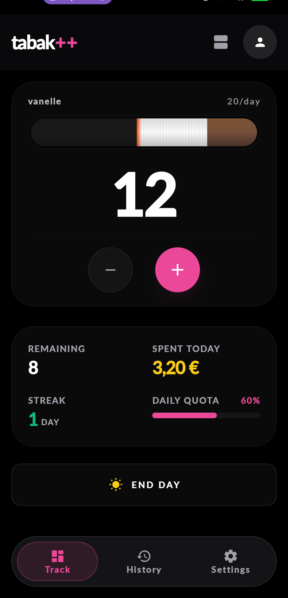
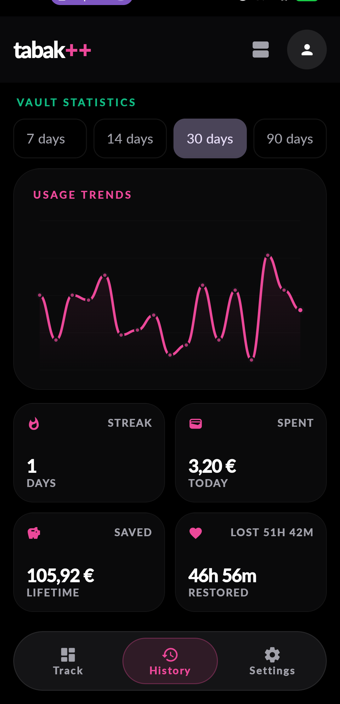
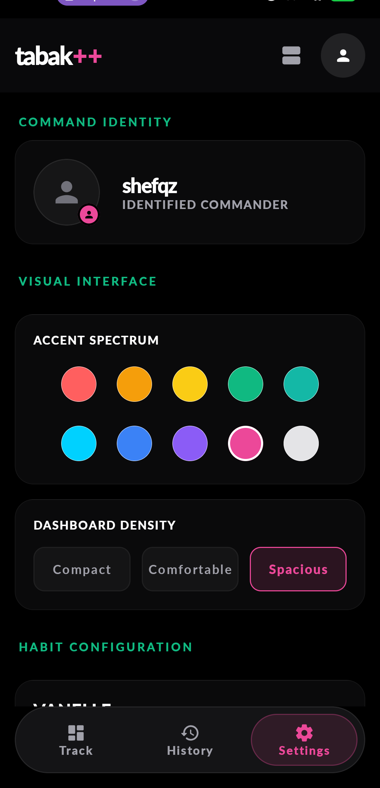

<p align="center">
  <a href="https://tabakpp.web.app"><strong>tabakpp.web.app</strong></a>
</p>

<h1 align="center">tabak++</h1>

<p align="center">
  Cut back with clarity — live counters, daily limits, streaks, and what it costs you.<br/>
  Android + web, synced in real time.
</p>

<p align="center">
  <a href="https://tabakpp.web.app"><strong>Open the web app</strong></a>
  ·
  <a href="SETUP_GUIDE.md">Setup</a>
  ·
  <a href="PRIVACY.md">Privacy</a>
</p>

---

### Web

<p align="center">
  
</p>

<p align="center">
  
  &nbsp;
  
</p>

### Android

<p align="center">
  
  &nbsp;
  
  &nbsp;
  
</p>

## Why it exists

Most quit apps bury you in tips. **tabak++** stays on the numbers that matter today: how many, how much left, how much spent, and whether you’re still on streak.

- One-tap logging with undo  
- Daily limits and an end-of-day archive  
- Spend / save / life-minutes at a glance  
- History you can edit and backfill  
- Phone and browser stay in sync  
- Accent colors and layout density you can tune  

## Platforms

| | |
|---|---|
| **Android** | Native Compose app |
| **Web** | Installable PWA at [tabakpp.web.app](https://tabakpp.web.app) |
| **iOS** | Experimental — see setup guide |

## Get started

Full install, Firebase, and signing notes: **[SETUP_GUIDE.md](SETUP_GUIDE.md)**

```bash
# Web
cd webApp && npm install && npm run dev

# Android — open in Android Studio, add google-services.json, run androidApp
```

---

<p align="center">Built by <a href="https://github.com/shareef01">shareef01</a></p>
