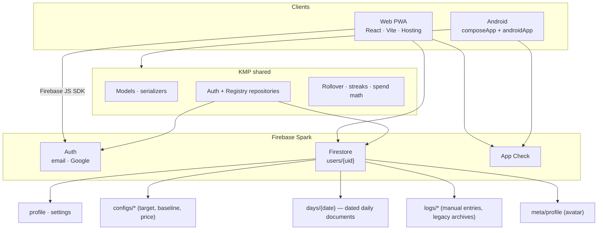
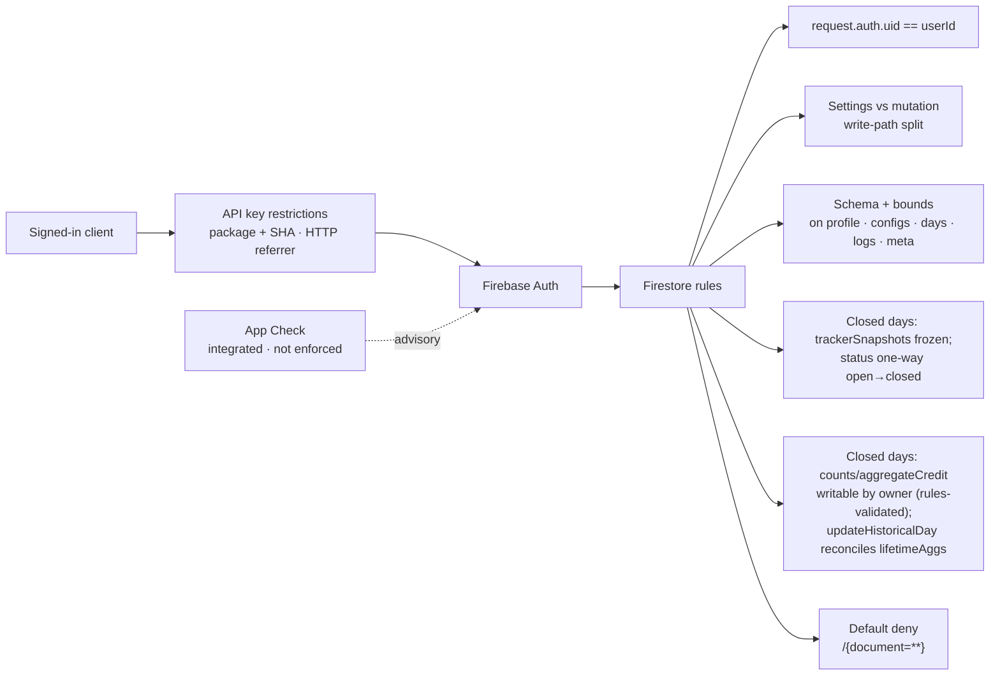

<p align="center">
  <a href="https://tabakpp.web.app"><strong>tabakpp.web.app</strong></a>
</p>

<h1 align="center">tabak++</h1>

<p align="center">
  Cut back with clarity — live counters, daily limits, streaks, and what it costs you.<br/>
  Android + web, synced over Firebase.
</p>

<p align="center">
  <a href="https://tabakpp.web.app"><strong>Open the web app</strong></a>
  ·
  <a href="https://github.com/shareef01/tabakpp/releases/latest"><strong>Download Android APK</strong></a>
  ·
  <a href="SETUP_GUIDE.md">Setup</a>
  ·
  <a href="PRIVACY.md">Privacy</a>
</p>

---

### Web

<p align="center">
  
</p>

<p align="center">
  
</p>

### Android

<p align="center">
  
  &nbsp;
  
</p>

## Why it exists

Most quit apps bury you in tips. **tabak++** stays on the numbers that matter today: how many, how much left, how much spent, and whether you’re still on streak.

- One-tap logging with undo  
- Daily limits that always land on the right day — see [Data model](#data-model)  
- Optional baseline tracking, so reduction and money saved are measured against
  your own history, not today's target  
- Spend / save / streaks at a glance, with population-level life-expectancy
  estimates clearly labeled as estimates, not personal facts  
- History you can edit and backfill  
- Bookmarkable `/track`, `/history`, `/settings` routes  
- Accent colors and layout density you can tune  

## Stack

Two clients, one backend. Shared domain logic on Android lives in a Kotlin Multiplatform module; the web app mirrors the same product surface in React.

| Layer | Tech |
|---|---|
| **Android** | Kotlin · Jetpack Compose (Compose Multiplatform UI) · GitLive Firebase |
| **Web** | React 18 · Vite · Tailwind · Firebase JS SDK · installable PWA |
| **Backend** | Firebase Auth (email + Google) · Cloud Firestore · App Check |
| **Shared (KMP)** | Models, repositories, day-rollover / streak / spend math |

Realtime listeners keep Track / History / Settings in sync across devices. Firestore rules gate reads and writes to the signed-in owner.

### Architecture


```mermaid
flowchart TB
  subgraph clients [Clients]
    Android["Android<br/>composeApp + androidApp"]
    Web["Web PWA<br/>React · Vite · Hosting"]
  end

  subgraph kmp [KMP shared]
    Models["Models · serializers"]
    Repos["Auth + Registry repositories"]
    Domain["Rollover · streaks · spend math"]
  end

  subgraph firebase [Firebase Spark]
    Auth["Auth<br/>email · Google"]
    FS["Firestore<br/>users/{uid}"]
    AC["App Check"]
  end

  Android --> kmp
  Web -->|"Firebase JS SDK"| Auth
  Web --> FS
  Web --> AC
  Repos --> Auth
  Repos --> FS
  Android --> AC

  FS --> Profile["profile · settings"]
  FS --> Configs["configs/* (target, baseline, price)"]
  FS --> Days["days/{date} — dated daily documents"]
  FS --> Logs["logs/* (manual entries, legacy archives)"]
  FS --> Meta["meta/profile (avatar)"]
```

### Data model

Every count belongs to an explicit tracking date, decided at the moment it's
written — never to a mutable "current session" bucket that could survive
across a rollover if the app was closed, a timer didn't fire, or "close day"
was never pressed.

```
users/{uid}                        profile + settings + lifetime rollup (rare writes)
users/{uid}/configs/{id}           trackers — target, optional baseline, price
users/{uid}/days/{YYYY-MM-DD}      counts + a stamped historical snapshot per
                                    tracker (name/target/baseline/price as of
                                    that day) + that day's financial credit.
                                    Closing a day only marks it complete and
                                    folds its credit into the profile rollup —
                                    it never decides which date a count
                                    belongs to.
users/{uid}/logs/{id}              legacy ledger: manual backfill entries,
                                    and pre-migration day archives
users/{uid}/meta/profile           avatar — kept off the profile document so
                                    a large, rarely-changing blob never rides
                                    along on every counter tap
```

Historical days are anchored at the rules level once closed: `firestore.rules`
(`validDayUpdate`, line 433) rejects any write that would change a closed day's
stamped `trackerSnapshots`, so raising or lowering a tracker's target today
can never retroactively change whether an old day was a success, and repricing
a tracker can never rewrite what an old day cost. `status`, `date`,
`foldedIntoLifetime`, and `legacyMigrationApplied` are also one-way or
identity-locked on closed days. `counts` and `aggregateCredit` remain writable
by the authenticated owner — the Firestore rules validate shape and bounds but
do not restrict writes to the application-layer `updateHistoricalDay` path.
That application path additionally reconciles `lifetimeAggregates` on the user
profile by the delta; a direct Firestore write can bypass that reconciliation.
Money saved and reduction are always computed
against a tracker's **baseline** (an optional, separate "previous average"
field), never against its target — hitting a goal and reducing from a
personal baseline are different claims and are never conflated.

Accounts created before this schema keep working: a one-time, idempotent
migration folds any leftover live counter state into the correct dated
document (using the same day-start-hour rule "End day" always used), and
moves the avatar out of the profile document, the first time an updated
client opens the account.

### Security


```mermaid
flowchart LR
  Client["Signed-in client"] --> Key["API key restrictions<br/>package + SHA · HTTP referrer"]
  Key --> Auth["Firebase Auth"]
  Auth --> Rules["Firestore rules"]

  Rules --> Owner["request.auth.uid == userId"]
  Rules --> Split["Settings vs mutation<br/>write-path split"]
  Rules --> Shape["Schema + bounds<br/>on profile · configs · days · logs · meta"]
  Rules --> Frozen["Closed days: trackerSnapshots frozen;<br/>status one-way open→closed"]
  Rules --> Writability["Closed days: counts/aggregateCredit<br/>writable by owner (rules-validated);<br/>updateHistoricalDay reconciles lifetimeAggs"]
  Rules --> Deny["Default deny<br/>/{document=**}"]

  AC["App Check<br/>integrated · not enforced"] -. advisory .-> Auth
```

Owner-only access under `users/{uid}`. Settings updates cannot touch counters; counter/archive writes cannot touch identity or pricing; once a `days/{date}` document is closed, its stamped `trackerSnapshots` can never be rewritten (while `counts` and `aggregateCredit` remain writable by the authenticated owner — subject only to Firestore rule shape/bounds validation, and reconciled with `lifetimeAggregates` only when written through the application-layer `updateHistoricalDay` path). Every write path is covered by rules tests run against the real Firestore emulator in CI. As a client-side self-tracking app on Firebase Spark tier (without Cloud Functions re-verifying every increment), Firestore Security Rules are the primary authorization and validation boundary protecting cross-user isolation.

**On App Check:** integrated on both clients (reCAPTCHA Enterprise on web, debug provider on Android) with enforcement **deliberately off**, so it is advisory rather than part of the security boundary.

That is a considered trade, not an oversight. Enforcement is per Firebase product and hits every client at once. Android release APKs use the debug provider, which mints a random secret per install that has to be registered by hand — so enforcing makes the APK unusable for anyone whose device you have not personally allow-listed, including anyone who downloads it from Releases. Since a working download matters more here than attestation, enforcement stays off and the authorization boundary is carried by **Firestore Security Rules** plus defense-in-depth **API key restrictions** (package + signing certificate on Android, HTTP referrer on web).

Enforcing becomes the right call once Android can attest for real — that means Play Integrity, which needs a Play Console project link. Upgrade path in [SETUP_GUIDE.md](SETUP_GUIDE.md).

## Platforms

| | |
|---|---|
| **Android** | Native app — install the latest APK from [GitHub Releases](https://github.com/shareef01/tabakpp/releases/latest) |
| **Web** | PWA at [tabakpp.web.app](https://tabakpp.web.app) |
| **iOS** | Not a release target — shell shows an unsupported gate (see setup guide) |

## Get started

Full Firebase, signing, and App Check notes: **[SETUP_GUIDE.md](SETUP_GUIDE.md)**

```bash
# Web
cd webApp && npm install && npm run dev

# Android — open in Android Studio, add google-services.json, run androidApp
# Or install a signed APK from GitHub Releases (tag v*)
```

---

<p align="center">Built by <a href="https://github.com/shareef01">shareef01</a></p>
