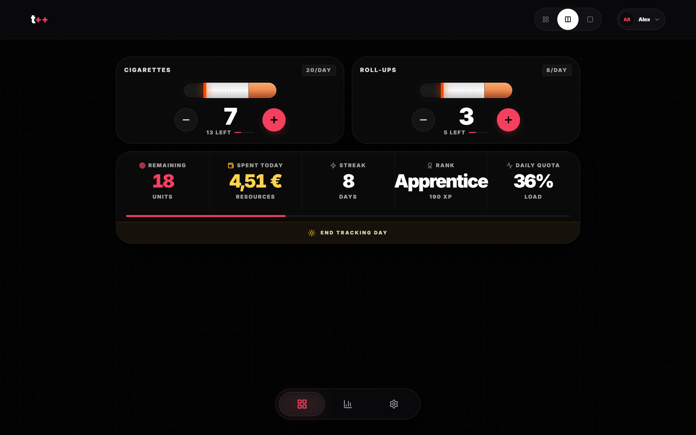
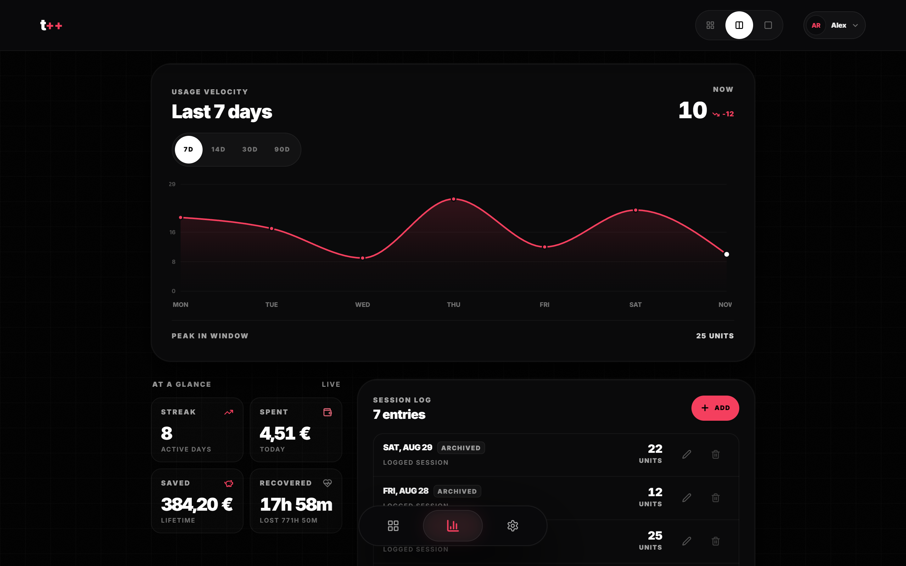
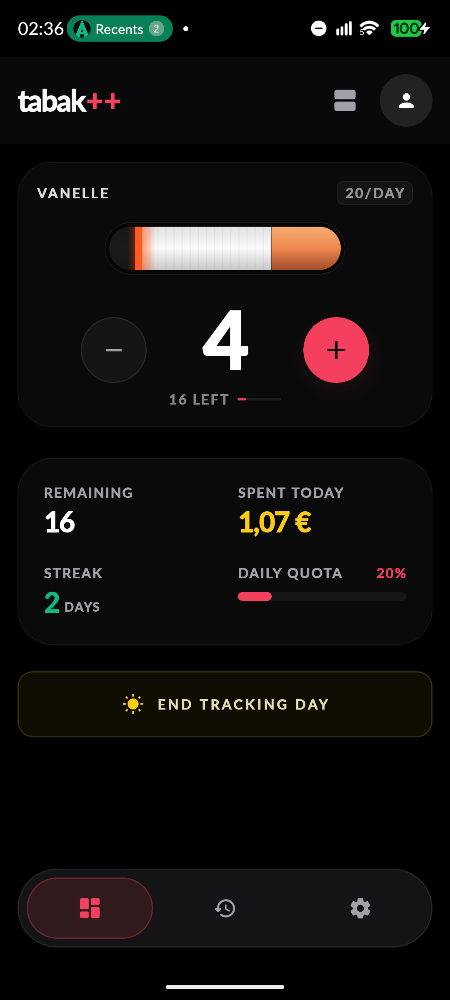
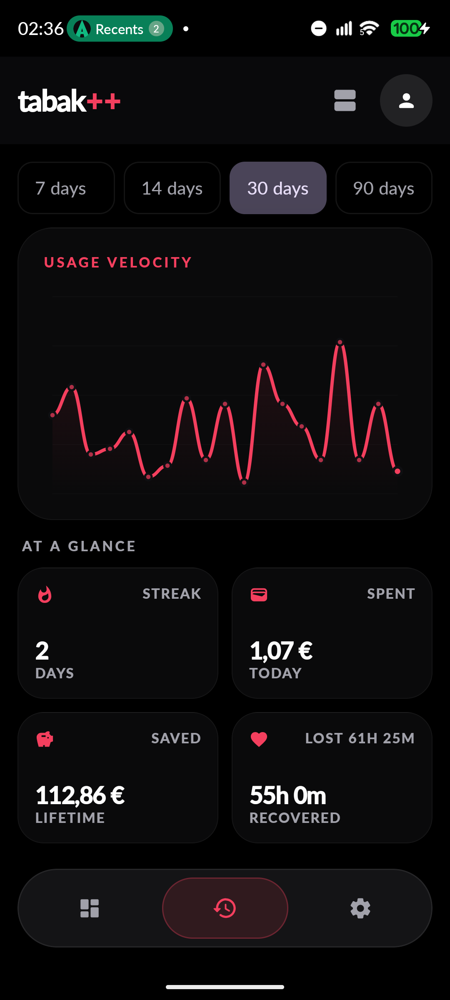
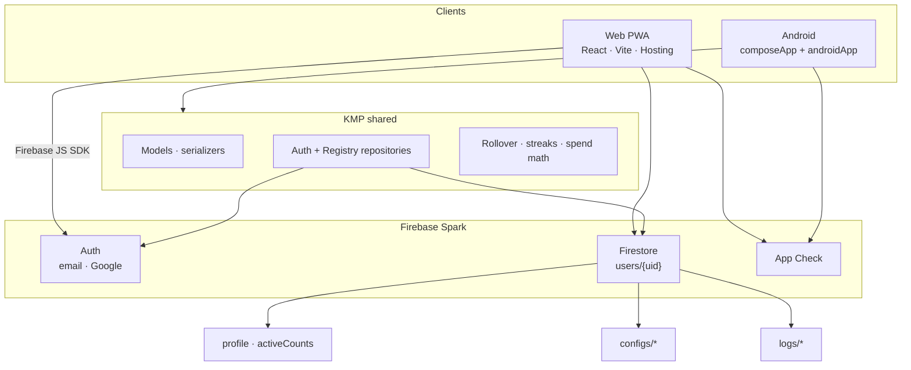
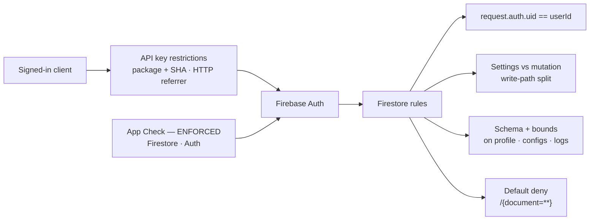

<p align="center">
  <a href="https://tabakpp.web.app"><strong>tabakpp.web.app</strong></a>
</p>

<h1 align="center">tabak++</h1>

<p align="center">
  Cut back with clarity — live counters, daily limits, streaks, and what it costs you.<br/>
  Android + web, synced over Firebase.
</p>

<p align="center">
  <a href="https://tabakpp.web.app"><strong>Open the web app</strong></a>
  ·
  <a href="https://github.com/shareef01/tabakpp/releases/latest"><strong>Download Android APK</strong></a>
  ·
  <a href="SETUP_GUIDE.md">Setup</a>
  ·
  <a href="PRIVACY.md">Privacy</a>
</p>

---

### Web

<p align="center">
  
</p>

<p align="center">
  
</p>

### Android

<p align="center">
  
  &nbsp;
  
</p>

## Why it exists

Most quit apps bury you in tips. **tabak++** stays on the numbers that matter today: how many, how much left, how much spent, and whether you’re still on streak.

- One-tap logging with undo  
- Daily limits and an end-of-day archive  
- Spend / save / life-minutes at a glance  
- History you can edit and backfill  
- Accent colors and layout density you can tune  

## Stack

Two clients, one backend. Shared domain logic on Android lives in a Kotlin Multiplatform module; the web app mirrors the same product surface in React.

| Layer | Tech |
|---|---|
| **Android** | Kotlin · Jetpack Compose (Compose Multiplatform UI) · GitLive Firebase |
| **Web** | React 18 · Vite · Tailwind · Firebase JS SDK · installable PWA |
| **Backend** | Firebase Auth (email + Google) · Cloud Firestore · App Check |
| **Shared (KMP)** | Models, repositories, day-rollover / streak / spend math |

Realtime listeners keep Track / History / Settings in sync across devices. Firestore rules gate reads and writes to the signed-in owner.

### Architecture


```mermaid
flowchart TB
  subgraph clients [Clients]
    Android["Android<br/>composeApp + androidApp"]
    Web["Web PWA<br/>React · Vite · Hosting"]
  end

  subgraph kmp [KMP shared]
    Models["Models · serializers"]
    Repos["Auth + Registry repositories"]
    Domain["Rollover · streaks · spend math"]
  end

  subgraph firebase [Firebase Spark]
    Auth["Auth<br/>email · Google"]
    FS["Firestore<br/>users/{uid}"]
    AC["App Check"]
  end

  Android --> kmp
  Web -->|"Firebase JS SDK"| Auth
  Web --> FS
  Web --> AC
  Repos --> Auth
  Repos --> FS
  Android --> AC

  FS --> Profile["profile · activeCounts"]
  FS --> Configs["configs/*"]
  FS --> Logs["logs/*"]
```

### Security


```mermaid
flowchart LR
  Client["Signed-in client"] --> Key["API key restrictions<br/>package + SHA · HTTP referrer"]
  Key --> Auth["Firebase Auth"]
  Auth --> Rules["Firestore rules"]

  Rules --> Owner["request.auth.uid == userId"]
  Rules --> Split["Settings vs mutation<br/>write-path split"]
  Rules --> Shape["Schema + bounds<br/>on profile · configs · logs"]
  Rules --> Deny["Default deny<br/>/{document=**}"]

  AC["App Check — ENFORCED<br/>Firestore · Auth"] --> Auth
```

Owner-only access under `users/{uid}`. Settings updates cannot touch counters; counter/archive writes cannot touch identity or pricing. Every write path is covered by rules tests run against the Firestore emulator in CI.

**On App Check:** it is **enforced** on Cloud Firestore and Firebase Authentication, so unattested requests are rejected — it is a live control, not decoration. Web attests through reCAPTCHA Enterprise and works for anyone.

**Android does not.** Release APKs use the debug App Check provider, which mints a random secret per install that has to be registered by hand in the Firebase Console. Combined with enforcement, that means **a sideloaded APK cannot sign in until its device token is registered** — in practice the Android build only works on the maintainer's own devices. Fixing that means Play Integrity, which needs a Play Console project link. See [SETUP_GUIDE.md](SETUP_GUIDE.md) for the full picture and the upgrade path.

## Platforms

| | |
|---|---|
| **Android** | Native app — install the latest APK from [GitHub Releases](https://github.com/shareef01/tabakpp/releases/latest) |
| **Web** | PWA at [tabakpp.web.app](https://tabakpp.web.app) |
| **iOS** | Not a release target — shell shows an unsupported gate (see setup guide) |

## Get started

Full Firebase, signing, and App Check notes: **[SETUP_GUIDE.md](SETUP_GUIDE.md)**

```bash
# Web
cd webApp && npm install && npm run dev

# Android — open in Android Studio, add google-services.json, run androidApp
# Or install a signed APK from GitHub Releases (tag v*)
```

---

<p align="center">Built by <a href="https://github.com/shareef01">shareef01</a></p>
