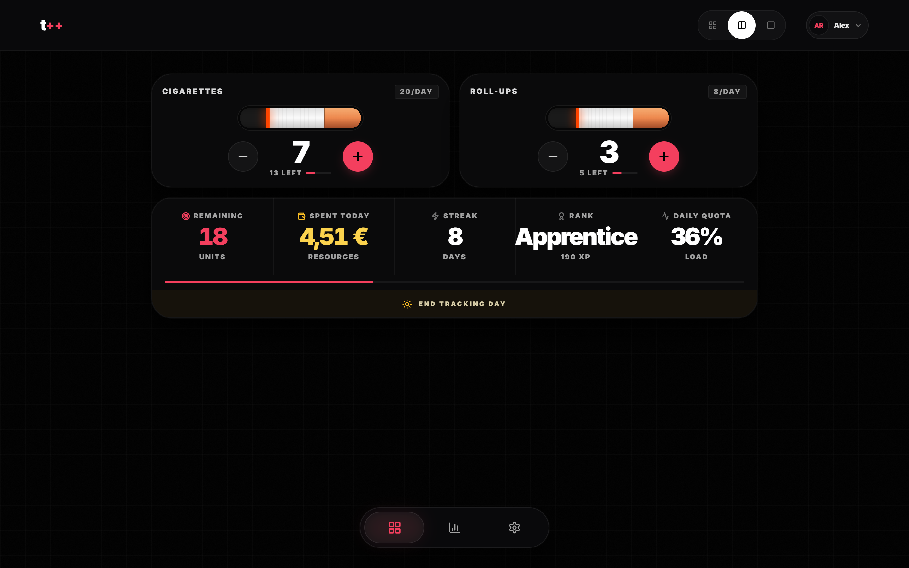
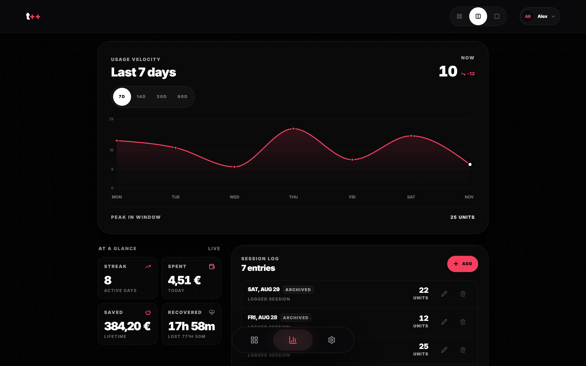
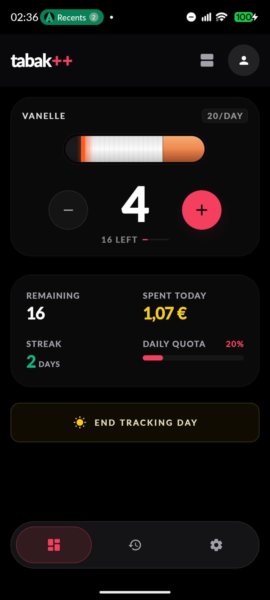
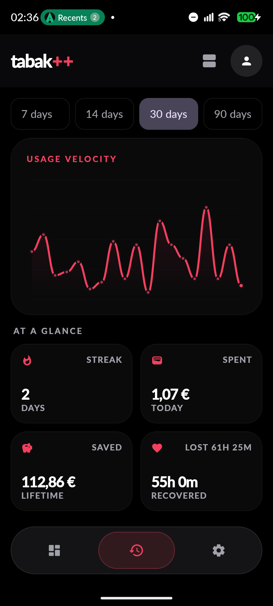
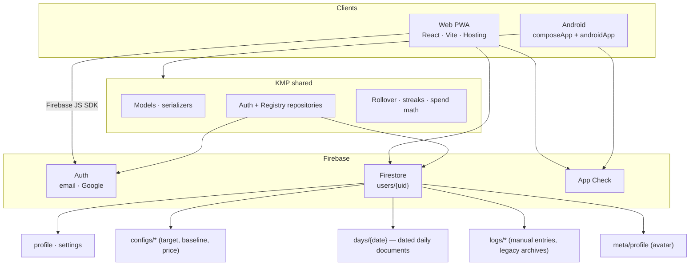
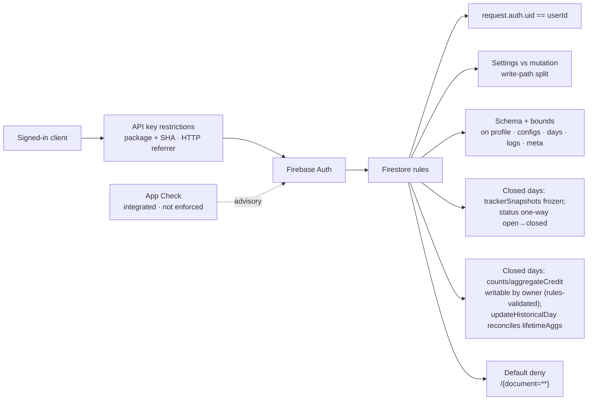

<p align="center">
  <a href="https://tabakpp.web.app"><strong>tabakpp.web.app</strong></a>
</p>

<h1 align="center">tabak++</h1>

<p align="center">
  A private, cross-platform tobacco-use tracker that keeps the numbers that matter
  today — how many, how much left, how much spent, and whether you're still on streak.
</p>

<p align="center">
  <a href="https://tabakpp.web.app"><strong>Open the web app</strong></a>
  ·
  <a href="https://github.com/shareef01/tabakpp/releases/latest"><strong>Download Android APK</strong></a>
  ·
  <a href="SETUP_GUIDE.md">Setup</a>
  ·
  <a href="PRIVACY.md">Privacy</a>
</p>

<p align="center">
  <a href="https://github.com/shareef01/tabakpp/actions/workflows/ci.yml?query=branch%3Amain"></a>
  <a href="https://github.com/shareef01/tabakpp/actions/workflows/android-integration.yml?query=branch%3Amain"></a>
  <a href="LICENSE"></a>
</p>

---

## Screenshots

### Web

<p align="center">
  
</p>

<p align="center">
  
</p>

### Android

<p align="center">
  
  &nbsp;
  
</p>

## Why it exists

Most quit apps bury you in tips. **tabak++** stays on the numbers that matter today: how many, how much left, how much spent, and whether you’re still on streak.

- One-tap logging with undo  
- Daily limits that always land on the right day — see [Data model](#data-model)  
- Optional baseline tracking, so reduction and money saved are measured against
  your own history, not today's target  
- Spend / save / streaks at a glance, with population-level life-expectancy
  estimates clearly labeled as estimates, not personal facts  
- History you can edit and backfill  
- Bookmarkable `/track`, `/history`, `/settings` routes  
- Accent colors and layout density you can tune  

## Highlights

- **One product, two clients.** An installable web PWA and a native Android app
  share one Firebase backend, so counters stay in sync across devices in realtime.
- **Dated counts, not ambient counters.** Every count belongs to an explicit
  tracking date decided when it is written, so a rollover is never lost because
  the app was closed or a timer didn't fire.
- **History you can't silently rewrite.** Once a day is closed, its stamped
  tracker snapshot is frozen by Firestore rules — repricing a tracker today can
  never rewrite what an old day cost.
- **Baseline ≠ target.** Money saved and reduction are measured against an
  optional personal baseline, never against a goal, because those are different claims.
- **Owner-only by construction.** Firestore Security Rules are the primary
  authorization boundary: default-deny, scoped to `users/{uid}`.
- **No backend team required.** No Cloud Functions needed — the application uses
  Firebase Auth, Cloud Firestore, and client-side security rules only.

## Stack

Two clients, one backend. Shared domain logic on Android lives in a Kotlin Multiplatform module; the web app mirrors the same product surface in React.

| Layer | Tech |
|---|---|
| **Android** | Kotlin 2.4 · Jetpack Compose (Compose Multiplatform UI) · GitLive Firebase |
| **Web** | React 19 · Vite 8 · Tailwind CSS 4 · Firebase JS SDK · installable PWA |
| **Backend** | Firebase Auth (email + Google) · Cloud Firestore · App Check (advisory) |
| **Shared (KMP)** | Models, serializers, repositories, day-rollover / streak / spend math |
| **Build** | Gradle 9.8 · AGP 9.4 · Java 17 bytecode · minSdk 26 · targetSdk 35 · compileSdk 37 |
| **Toolchain** | Node 22.23.2 ([`.nvmrc`](.nvmrc)) · npm 10.9.8 (`packageManager`) |

Realtime listeners keep Track / History / Settings in sync across devices. Firestore rules gate reads and writes to the signed-in owner.

### Architecture


```mermaid
flowchart TB
  subgraph clients [Clients]
    Android["Android<br/>composeApp + androidApp"]
    Web["Web PWA<br/>React · Vite · Hosting"]
  end

  subgraph kmp [KMP shared]
    Models["Models · serializers"]
    Repos["Auth + Registry repositories"]
    Domain["Rollover · streaks · spend math"]
  end

  subgraph firebase [Firebase]
    Auth["Auth<br/>email · Google"]
    FS["Firestore<br/>users/{uid}"]
    AC["App Check"]
  end

  Android --> kmp
  Web -->|"Firebase JS SDK"| Auth
  Web --> FS
  Web --> AC
  Repos --> Auth
  Repos --> FS
  Android --> AC

  FS --> Profile["profile · settings"]
  FS --> Configs["configs/* (target, baseline, price)"]
  FS --> Days["days/{date} — dated daily documents"]
  FS --> Logs["logs/* (manual entries, legacy archives)"]
  FS --> Meta["meta/profile (avatar)"]
```

### Data model

Every count belongs to an explicit tracking date, decided at the moment it's
written — never to a mutable "current session" bucket that could survive
across a rollover if the app was closed, a timer didn't fire, or "close day"
was never pressed.

```
users/{uid}                        profile + settings + lifetime rollup (rare writes)
users/{uid}/configs/{id}           trackers — target, optional baseline, price
users/{uid}/days/{YYYY-MM-DD}      counts + a stamped historical snapshot per
                                    tracker (name/target/baseline/price as of
                                    that day) + that day's financial credit.
                                    Closing a day only marks it complete and
                                    folds its credit into the profile rollup —
                                    it never decides which date a count
                                    belongs to.
users/{uid}/logs/{id}              legacy ledger: manual backfill entries,
                                    and pre-migration day archives
users/{uid}/meta/profile           avatar — kept off the profile document so
                                    a large, rarely-changing blob never rides
                                    along on every counter tap
```

Historical days are anchored at the rules level once closed: the `validDayUpdate`
helper in [`firestore.rules`](firestore.rules) rejects any write that would change a
closed day's stamped `trackerSnapshots`, so raising or lowering a tracker's target today
can never retroactively change whether an old day was a success, and repricing
a tracker can never rewrite what an old day cost. `status`, `date`,
`foldedIntoLifetime`, and `legacyMigrationApplied` are also one-way or
identity-locked on closed days. `counts` and `aggregateCredit` remain writable
by the authenticated owner — the Firestore rules validate shape and bounds but
do not restrict writes to the application-layer `updateHistoricalDay` path.
That application path additionally reconciles `lifetimeAggregates` on the user
profile by the delta; a direct Firestore write can bypass that reconciliation.
Money saved and reduction are always computed
against a tracker's **baseline** (an optional, separate "previous average"
field), never against its target — hitting a goal and reducing from a
personal baseline are different claims and are never conflated.

Accounts created before this schema keep working: a one-time, idempotent
migration folds any leftover live counter state into the correct dated
document (using the same day-start-hour rule "End day" always used), and
moves the avatar out of the profile document, the first time an updated
client opens the account.

## Security & Privacy

See [SECURITY.md](SECURITY.md) for the full threat model and
[PRIVACY.md](PRIVACY.md) for data handling and retention.


```mermaid
flowchart LR
  Client["Signed-in client"] --> Key["API key restrictions<br/>package + SHA · HTTP referrer"]
  Key --> Auth["Firebase Auth"]
  Auth --> Rules["Firestore rules"]

  Rules --> Owner["request.auth.uid == userId"]
  Rules --> Split["Settings vs mutation<br/>write-path split"]
  Rules --> Shape["Schema + bounds<br/>on profile · configs · days · logs · meta"]
  Rules --> Frozen["Closed days: trackerSnapshots frozen;<br/>status one-way open→closed"]
  Rules --> Writability["Closed days: counts/aggregateCredit<br/>writable by owner (rules-validated);<br/>updateHistoricalDay reconciles lifetimeAggs"]
  Rules --> Deny["Default deny<br/>/{document=**}"]

  AC["App Check<br/>integrated · not enforced"] -. advisory .-> Auth
```

Owner-only access under `users/{uid}`. Settings updates cannot touch counters; counter/archive writes cannot touch identity or pricing; once a `days/{date}` document is closed, its stamped `trackerSnapshots` can never be rewritten (while `counts` and `aggregateCredit` remain writable by the authenticated owner — subject only to Firestore rule shape/bounds validation, and reconciled with `lifetimeAggregates` only when written through the application-layer `updateHistoricalDay` path). Every write path is covered by rules tests run against the real Firestore emulator in CI. As a client-side self-tracking app that uses no Cloud Functions to re-verify every increment, Firestore Security Rules are the primary authorization and validation boundary protecting cross-user isolation.

Engineering controls behind those claims:

- **Immutable CI action pins** — every third-party GitHub Action is pinned to a
  full 40-character commit SHA, enforced in CI by
  [`.github/scripts/validate-action-pins.py`](.github/scripts/validate-action-pins.py).
- **Reproducible installs** — CI installs with `npm ci` against a committed
  lockfile, plus a dedicated lockfile-integrity check.
- **Dependency auditing** — `npm run audit:prod` fails the build on any HIGH or
  CRITICAL production advisory.
- **Emulator-backed rule testing** — Firestore rules are tested against a real
  Firestore emulator in CI, not mocked.

**On App Check:** integrated on both clients (reCAPTCHA Enterprise on web, Play Integrity in Android release builds / debug provider in Android debug builds) with enforcement **deliberately off**, so it is advisory rather than part of the security boundary.

That is a considered trade, not an oversight. Enforcement is per Firebase product and hits every client at once. Android release APKs now request Play Integrity tokens, but until the Play Integrity / Firebase App Check production configuration and metrics are verified, release requests cannot be assumed to be verified App Check traffic. Enforcement must remain off because it could reject legitimate release clients. Android debug builds still use the debug provider, which mints a random secret per install that has to be registered by hand. Since a working download matters more here than attestation, enforcement stays off and the authorization boundary is carried by **Firestore Security Rules** plus defense-in-depth **API key restrictions** (package + signing certificate on Android, HTTP referrer on web).

Enforcing becomes the right call once Android can attest for real — that means Play Integrity, which needs a Play Console project link. See the upgrade path in [SETUP_GUIDE.md](SETUP_GUIDE.md).

## Platforms

| | |
|---|---|
| **Android** | Native app (Kotlin · Compose Multiplatform) — install the latest APK from [GitHub Releases](https://github.com/shareef01/tabakpp/releases/latest) |
| **Web** | Installable PWA at [tabakpp.web.app](https://tabakpp.web.app) |
| **iOS** | Not a release target. The Compose shell is present but shows an explicit unsupported gate (see [SETUP_GUIDE.md](SETUP_GUIDE.md)) |

## Getting Started

Full Firebase, signing, and App Check notes: **[SETUP_GUIDE.md](SETUP_GUIDE.md)**

### Prerequisites

| | |
|---|---|
| **Web** | Node **22.23.2** ([`.nvmrc`](.nvmrc)) and npm **10.9.8** (pinned via `packageManager`) |
| **Android** | JDK 17+ and Android Studio, plus `google-services.json` (see [SETUP_GUIDE.md](SETUP_GUIDE.md)) |
| **Firebase tooling** | [Firebase CLI](https://firebase.google.com/docs/cli) — only needed for the local Firestore emulator / rules tests |

### Web

```bash
cd webApp
npm ci          # reproducible install from the committed lockfile
npm run dev     # Vite dev server
```

Copy `webApp/.env.example` to `webApp/.env.local` and fill in your Firebase web
app config before the app will render.

```bash
npm run build        # production build -> webApp/dist
npm run lint         # ESLint
npm run audit:prod   # production dependency audit (fails on HIGH/CRITICAL)
```

### Android

Open the repository in Android Studio and run the `androidApp` configuration after
adding `google-services.json`, or install a signed APK from
[GitHub Releases](https://github.com/shareef01/tabakpp/releases/latest).

```bash
./gradlew :androidApp:assembleDebug
```

## Testing

| Suite | Command | Protects |
|---|---|---|
| Unit + coverage | `npm run coverage` | Web app behavior and domain math |
| Cross-platform contract | `npm run test:contract` | Semantic parity between the JS and Kotlin ports of the domain math |
| Firestore rules | `npm run test:rules` | Real authorization rules, executed against the Firestore emulator |
| Android instrumentation | `./gradlew :androidApp:connectedDebugAndroidTest` | Android/KMP behavior against a real emulator |

The contract fixtures in [`shared-tests/`](shared-tests/) are the important one:
the JS and Kotlin domain implementations are hand-mirrored rather than code-shared,
so a shared set of semantic vectors is what catches drift between them. See
[shared-tests/README.md](shared-tests/README.md).

Android instrumentation runs in CI for every pull request and every push to
`main`, and preserves emulator logs, logcat, and per-run test metadata as a
downloadable artifact for each attempt — including failed ones.

## Firebase / Local Emulator Development

Firestore rules tests boot a local emulator, so no live project is needed:

```bash
cd webApp
npm run test:rules
```

## Repository Structure

```
tabakpp/
├── webApp/            React 19 PWA (Vite, Tailwind, Vitest, Firebase JS SDK)
├── shared/            Kotlin Multiplatform: models, serializers, repositories
├── composeApp/        Compose Multiplatform UI shared across targets
├── androidApp/        Android application module
├── iosApp/            iOS shell — intentionally a non-release "unsupported" gate
├── shared-tests/      Cross-platform domain contract fixtures (JS ⇄ Kotlin)
├── assets/screenshots/ Showcase and themed screenshots used by the README
├── scripts/           Screenshot/demo tooling
├── .github/           Workflows, action-pin validator, release notes
│   ├── workflows/     ci.yml · android-integration.yml · release-android.yml
│   └── scripts/       validate-action-pins.py · validate-lockfile.py
├── firestore.rules    Authorization + validation (the primary security boundary)
├── firebase.json      Emulator / hosting configuration
└── build.gradle.kts · settings.gradle.kts · gradle/libs.versions.toml
```

## Development Notes

**Firestore gRPC dependency override.** `webApp/package.json` carries a scoped
npm override pinning the Node-only `@grpc/grpc-js` dependency of
`@firebase/firestore` to a patched release, because released Firestore currently
declares a range that cannot reach one. It keeps the production dependency audit
green. Remove it once a released `@firebase/firestore` range resolves to a
non-vulnerable gRPC release without an override — upstream tracking lives at
[firebase/firebase-js-sdk#10400](https://github.com/firebase/firebase-js-sdk/issues/10400).

**Node and npm are pinned, not merely recommended.** `.nvmrc` and the
`packageManager` field exist so local runs and CI resolve the same dependency
tree; changing either will produce a lockfile diff.

## Contributing

External contributions are welcome through pull requests. For anything touching
security rules, data-model semantics, or CI, please open an issue first so the
approach can be discussed — those areas carry invariants that are easy to break
silently.

By contributing you agree that your work is licensed under the [MIT License](LICENSE).

## License

[MIT](LICENSE) © 2026 shareef01

## Author

Created and maintained by [@shareef01](https://github.com/shareef01).
