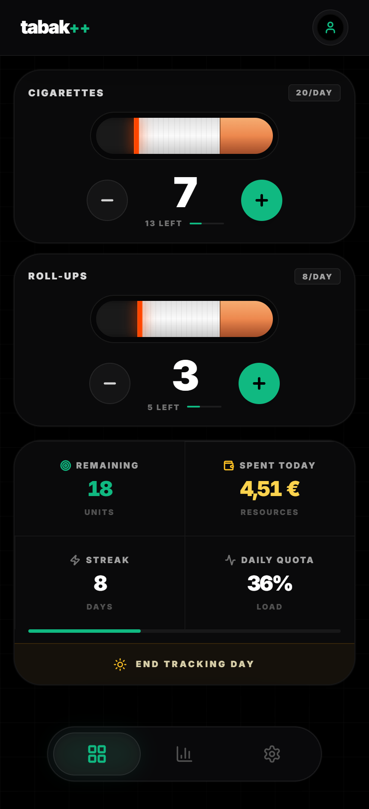
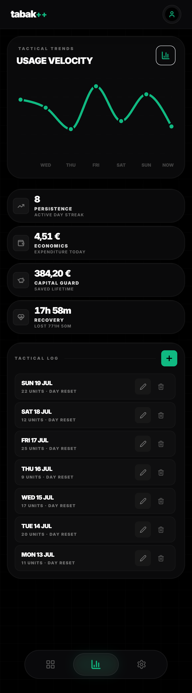
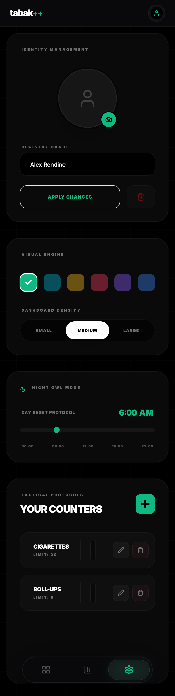

# tabak++ (t++) — Web PWA

React PWA companion to the Kotlin Multiplatform mobile app. Shares the same Firebase Auth + Firestore backend on the **Spark (free) plan** — no Cloud Functions required.

  

  
  &nbsp;
  

## Features
- Live trackers with the same Firestore schema as Android
- History velocity chart, streaks, and financial metrics
- Settings: identity, accent, density, day start, economics, account delete
- PWA service worker caches the app shell only (Auth/Firestore stay NetworkOnly)
- Optional App Check (reCAPTCHA v3) — enforce in Console after tokens work
- iPhone-friendly PWA: safe-area insets, redirect Google auth, 16px inputs, Home Screen icons

## Stack
React 18 · Vite · Tailwind · Recharts · Framer Motion · Firebase Auth/Firestore · Vitest

## Live
[https://tabakpp.web.app](https://tabakpp.web.app)

See the root [SETUP_GUIDE.md](../SETUP_GUIDE.md) for Spark-safe Firebase setup and App Check checklist.
